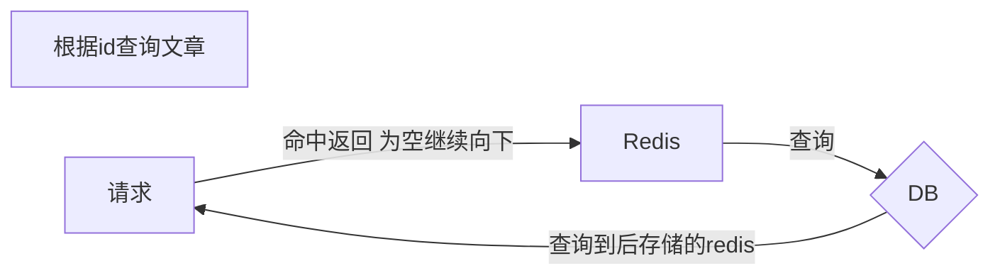
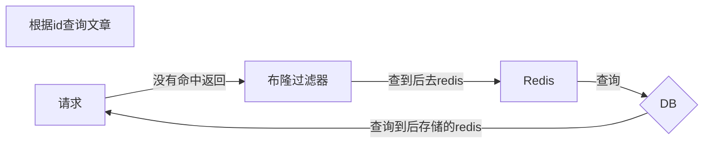

---
tags:
  - top
---
# redis篇

## 1 使用场景

### 1.1 缓存

一个get请求（/query/user/**123**），当查询到一个不存在的数据时，mysql查不到数据也不会写入到缓存中，每次请求都会查询数据库。

恶意攻击：发送大量请求不存在的数据，会击垮数据库。

解决方案一：缓存空数据 例如：（key:123 value:NULL）缺点：占用空间大（key有很多）

解决方案二：布隆过滤器

布隆过滤器：

位图（bitmap）: 相当于是一个以bit为单位的数组，每个单元只存储0和1

布隆过滤器可以检索一个元素是否在一个集合中。

例如id为1的数据经过上次hash计算得出1 3 9 ，那么就去位图中下标为1 3 9的位置查询 如果三个位置都是1 那么该元素在集合中。如果有一个不是1 那么肯定不在元素中。

#### 1.1.1 穿透 击穿 雪崩

#### 1.1.2 双写一致 持久化

#### 1.1.3 数据过期 淘汰策略

### 1.2 分布式锁

#### 1.2.1 setnx redisson

### 1.3 计数器

### 1.4 保存token

### 1.5 消息队列

### 1.6 延迟队列

## 2 其他题目

### 2.1 集群

#### 2.1.1 主从

#### 2.1.2 哨兵

#### 2.1.3 集群

### 2.2 事务

### 2.3 redis为什么那么快
